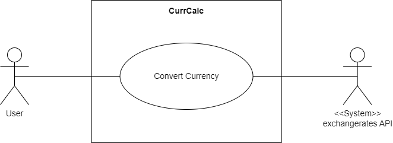
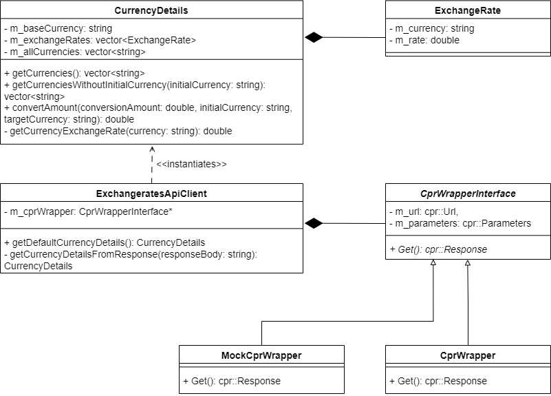
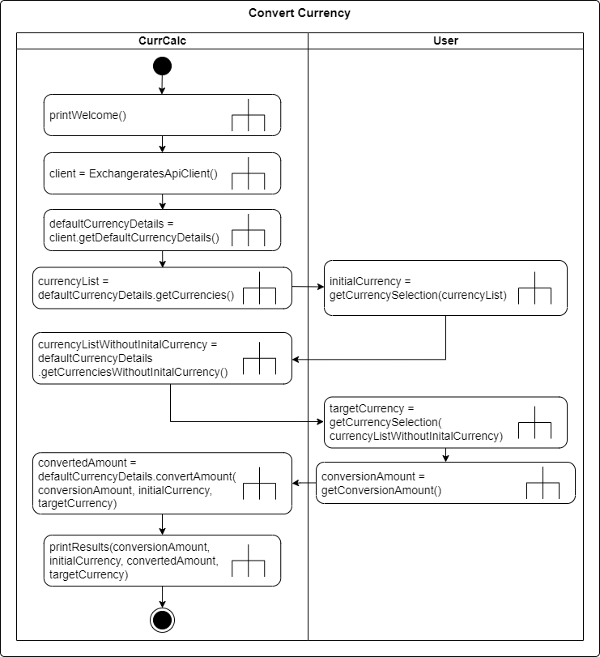
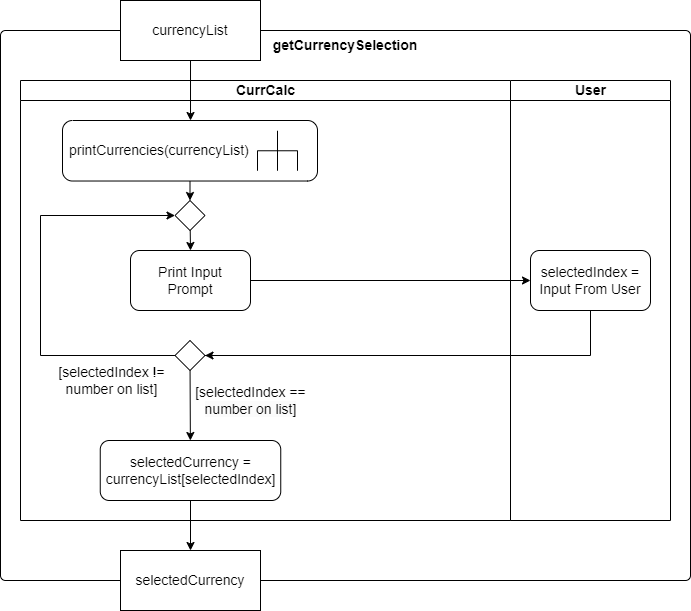
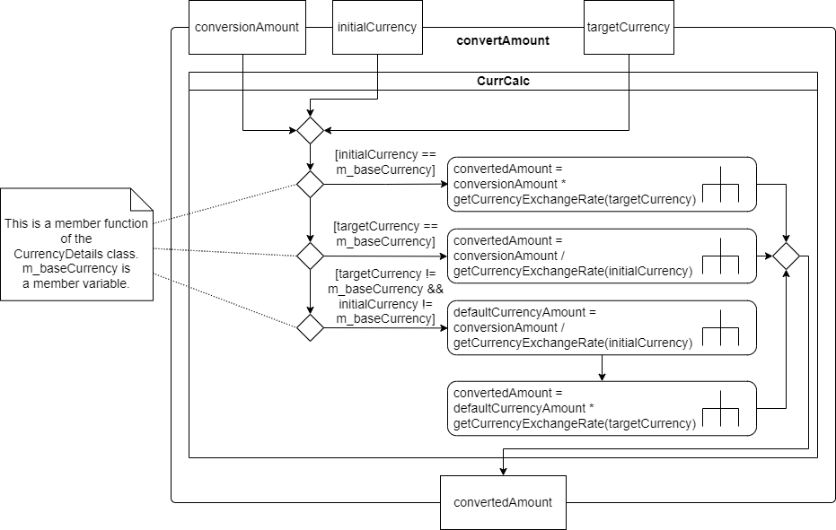

# Software Design

This file contains all the documentation to CurrCalc's software design. This includes functional requirements, non-functional requirements, and architectural diagrams and their descriptions.

## Table of Contents
1. **[Goal](#goal)**</br>
2. **[Rough Overview](#rough-overview)**</br>
3. **[Requirements](#requirements)**</br>
  3.1 **[Functional Requirements](#functional-requirements)**</br>
  3.2 **[Non-Functional Requirements](#non-functional-requirements)**</br>
4. **[Use Cases](#use-cases)**</br>
  4.1 **[Use Case Diagram](#use-case-diagram)**</br>
  4.2 **[Use Case Description](#use-case-description)**</br>
5. **[Class Diagram](#class-diagram)**</br>
6. **[Activity Diagrams](#activity-diagrams)**</br>
  6.1 **[Convert Currency](#convert-currency)**</br>
  6.2 **[getDefaultCurrencyDetails](#getdefaultcurrencydetails)**</br>
  6.3 **[getCurrencySelection](#getcurrencyselection)**</br>
  6.4 **[convertAmount](#convertamount)**</br>

# Goal

CurrCalc is a console-based program, written in C++20, that converts an amount of money from one currency to another. The initial and target currencies, as well as the amount, are provided by the user while the currency data is fetched from the [exchangerates API](https://exchangeratesapi.io/documentation/).

# Rough Overview


A user interacts with CurrCalc by selecting the initial and target currencies and specifying the conversion amount. 
CurrCalc requests currency data, like the list of available currencies and exchange rates from the external exchangesrates API. The API responds with a status code and the requested data or, in case of a failure, with just a status code. The REST protocol is used in the communication between CurrCalc and the exchangerates API.

# Requirements

Here are CurrCalc's functional and non-functional requirements.

## Functional Requirements

| ID        	| Title                          | Description/Use Case (where possible)  														  |
| ------------- | ------------------------------ | ------------------------------------------------------------------------------------------------------------------------------------------------------ |
| CurrCalc_FR_1 | Fetch Currencies 		 | CurrCalc should fetch the list of all available currencies from the exchangerates API, so a user is guaranteed up-to-date currency information. 	  |
| CurrCalc_FR_2 | Select Initial/Target Currency | As a user, I want to select the initial and target currencies for the conversion from a numbered list, so I know what currencies are available. |
| CurrCalc_FR_3 | Specify Conversion Amount 	 | As a user, I want to type in the amount I would like to convert from the initial currency to the target one. |
| CurrCalc_FR_4 | Fetch Exchange Rates	 | CurrCalc should fetch exchange rates from the exchangerates API, so a user is guaranteed up-to-date exchange rates for the initial and target currencies. |
| CurrCalc_FR_5 | Convert Amount		 | CurrCalc should convert the specified amount from the selected initial currency to the selected target currency using the appropriate exchange rate fetched in CurrCalc_FR_4. |

## Non-Functional Requirements

| ID        	 | Title                          | Description																		   |
| -------------- | ------------------------------ | ------------------------------------------------------------------------------------------------------------------------------------------------------ |
| CurrCalc_NFR_1 | Do Not Store API Key In The Repository | The API key to the exchangerates API should not be stored in the online GitHub repository. 	  |
| CurrCalc_NFR_2 | Retry Failed REST Requests 	  | If the data retrieval requests specified in CurrCalc_FR_2 and CurrCalc_FR_4 return with status code 503, they should be retried three more times in intervals of three seconds. If no successful request can be processed after that, CurrCalc should terminate with an error message.   |
| CurrCalc_NFR_3 | Keep Precision of Five Fractional Digits For Conversion 	  | For the conversion an amount with a maximum of five fractional digits should be accepted. If the user inputs more than that, the amount should be rounded to five fractional digits.  |

# Use Cases

## Use Case Diagram



There is only one possible use case when interacting with CurrCalc. The "Convert Currency" use case is triggered when the user starts the program, therefore the user is the primary actor. The exchangerates API is a secondary actor in this use case as CurrCalc must fetch the currency information from it.

## Use Case Description

<table>
	<tbody>
	<tr>
		<td>Title</td>
		<td>Convert Currency</td>
	</tr>
	<tr>
		<td>Description</td>
		<td>The user converts a specified amount from a selected initial currency to a selected target currency. The currency data is fetched from an external API.</td>
	</tr>
	<tr>
		<td>Actor(s)</td>
		<td>User, exchangerates API</td>
	</tr>
	<tr>
		<td>Goal</td>
		<td>Conversion of a specified amount of money from one currency into another using up-to-date currency data.</td>
	</tr>
	<tr>
		<td>Preconditions(s)</td>
		<td>CurrCalc has been started by the user.</td>
	</tr>
	<tr>
		<td>Basic Flow</td>
		<td>
			<ol type="1">
				<li>CurrCalc prints a welcome message for the user in the terminal</li>
				<li>CurrCalc sends an HTTP GET request to the exchangerates API to retrieve default currency details
					<ol type="i">
						<li>The API responds with a JSON object containing the default currency details, which includes all exchange rates</li>
					</ol>
				</li>
				<li>CurrCalc extracts all currencies from the exchange rates</li>
				<li>CurrCalc outputs all currencies in a numbered list and prompts the user to pick one for the initial currency
					<ol type="i">
						<li>The user types in the number of the desired initial currency
							<ol type="a">
								<li>CurrCalc confirms the selection</li>
							</ol>
						</li>
					</ol>
				</li>
				<li>CurrCalc outputs all currencies, excluding the initial one, in a numbered list and prompts the user to pick one for the target currency
					<ol type="i">
						<li>The user types in the number of the desired target currency
							<ol type="a">
								<li>CurrCalc confirms the selection</li>
							</ol>
						</li>
					</ol>
				</li>
				<li>CurrCalc prompts the user to specify the conversion amount
					<ol type="i">
						<li>The user types in the desired amount as a decimal number
							<ol type="a">
								<li>CurrCalc confirms the selection</li>
								<li>CurrCalc rounds the amount to five fractional digits</li>
							</ol>
						</li>
					</ol>
				</li>
				<li>CurrCal converts the specified amount from the initial currency into the target currency</li>
				<li>The program outputs the result of the calculation</li>
				<li>CurrCalc terminates</li>
			</ol>
		</td>
	</tr>
	<tr>
		<td>Post Condition(s)</td>
		<td>The specified amount has been converted from the selected initial currency to the selected target currency. CurrCalc has terminated.</td>
	</tr>
	<tr>
		<td>Alternative Flow(s)</td>
		<td>
			In 2.i: The API responds with status codes 503
			<ol type="1">
				<li>CurrCalc retries the request three more times in intervals of three seconds
					<ol type="i">
						<li>In case of a successful request (status code 200), CurrCalc continues - back to 2.i in the basic flow</li>
						<li>In case all the attempts fail, CurrCalc informs the user of the situation and offers possible solutions
							<ol type="a">
								<li>CurrCalc terminates</li>
							</ol>
						</li>
					</ol>
				</li>
			</ol><br/>
			In 2.i: The API responds with a status code other than 200, or 503
			<ol type="1">
				<li>CurrCalc informs the user of the error
					<ol type="i">
						<li>CurrCalc terminates</li>
					</ol>
				</li>
			</ol><br/>
			In 4.i: The user types in an integer that is not on the list, a character, or a string
			<ol type="1">
				<li>CurrCalc responds with a prompt to make a selection based on the numbers provided in the list - back to 4 in the basic flow</li>
			</ol><br/>
			In 4.i: The user types in a decimal number, whose whole number part is on the list
			<ol type="1">
				<li>The fractional part of the number is truncated - proceed with 4.i.a in the basic flow</li>
			</ol><br/>
			In 4.i: The user types in a decimal number, whose whole number part is not on the list
			<ol type="1">
				<li>The fractional part of the number is truncated</li>
				<li>CurrCalc responds with a prompt to make a selection based on the numbers provided in the list - back to 4 in the basic flow</li>
			</ol><br/>
			In 5.i: The user types in an integer that is not on the list, a character, or a string
			<ol type="1">
				<li>CurrCalc responds with a prompt to make a selection based on the numbers provided in the list - back to 5 in the basic flow</li>
			</ol><br/>
			In 5.i: The user types in a decimal number, whose whole number part is on the list
			<ol type="1">
				<li>The fractional part of the number is truncated - proceed with 5.i.a in the basic flow</li>
			</ol><br/>
			In 5.i: The user types in a decimal number, whose whole number part is not on the list
			<ol type="1">
				<li>The fractional part of the number is truncated</li>
				<li>CurrCalc responds with a prompt to make a selection based on the numbers provided in the list - back to 5 in the basic flow</li>
			</ol><br/>
			In 6.i: The user types in a positive integer
			<ol type="1">
				<li>CurrCalc converts the integer into a decimal number and confirms the selection - proceed with 6.i.a in the basic flow</li>
			</ol><br/>
			In 6.i: The user types in a negative decimal number, a negative integer, a character, or a string
			<ol type="1">
				<li>CurrCalc responds with a prompt to type in an unsigned number for the sum - back to 6.i in the basic flow</li>
			</ol><br/>
		</td>
	</tbody>
</table>

# Class Diagram



CurrencyDetails:<br/> 
This class is really the heart of the application as it contains all the data that is processed for the user. It contains three private properties: ```m_baseCurrency``` which represents the name of the currency, a list called ```m_exchangeRates```, and a list called ```m_allCurrencies```.<br/> 
Since ```ExchangeRate``` objects can only exist as part of a ```CurrencyDetails``` object, the m_exchangeRates field leads to a composition relationship from CurrencyDetails to ExchangeRate.<br/>
m_allCurrencies is a list of all currencies that are extracted from m_exchangeRates during an object's construction.<br/> 
Usually, getter-methods are not mentioned in class diagrams but the public methods ```getCurrencies()``` and ```getCurrenciesWithoutInitialCurrency()``` are somewhat important. They use m_allCurrencies to return the list of all currencies but latter just excludes the initial currency from the list.<br/> 
The public ```convertAmount()``` method takes a conversion amount, and the initial and target currencies to perform a conversion using m_exchangeRates.<br/>

ExchangeRate:<br/> 
Only holds two public properties, a string called ```m_currency``` for the name of the currency, and a double called ```m_rate``` for the actual exchange rate.<br/>

ExchangeratesApiClient:<br/>
As its name states, it represents the client that sends requests to the exchangesrates API and handles the responses. Its only property is ```m_cprWrapper```, a pointer to a ```CprWrapperInterface``` object, which leads to a composition relationship to that class. This will be explained in the next paragraph.<br/>
The public ```getDefaultCurrencyDetails()``` method sends a request to the API to retrieve the currency details of the API's default currency (currently it's EUR). Then it utilizes the private ```getCurrencyDetailsFromResponse()``` method, which takes the response body as an argument, to extract and transform the information into a CurrencyDetails object.<br/>

CprWrapperInterface:<br/> 
Wraps the ```Get()``` method from the cpr library in a virtual method of the same name. Cpr's Get() method simply sends GET requests to APIs using a URL and parameters. That is why CprWrapperInterface has the two private attributes ```m_url``` and ```m_parameters```.<br/>
Two concrete classes inherit from this abstract one: ```CprWrapper``` and ```MockCprWrapper```.<br/>
CprWrapper implements the inherited Get() method to make it return the cpr library's Get() method.<br/>
MockCprWrapper just mocks the Get() method for testing purposes. This is why CprWrapperInterface mainly exists: to decouple the code and make it more testable for unit tests.

# Activity Diagrams

These activity diagrams showcase some of CurrCalc's flow on a technical level. Their target audience are therefore software engineers.
Not every activity in the program is modeled in a diagram, only the ones that are vital to understanding the overall flow.  

## Convert Currency



The activity diagram above showcases the main flow of the program. That is why is carries the name of the use case described above: Convert Currency<br/> 
Once CurrCalc is started, it prints a welcome message for the user and creates a ```client``` to connect with the exchangerates API. The client (via ```getDefaultCurrencyDetails()```) then sends a REST request to the API to retrieve the default currency details which is stored in ```defaultCurrencyDetails```.<br/> 
Since defaultCurrencyDetails contains all exchange rates, the list of all currencies is extracted from it and stored in ```currencyList```. This currencyList is then used to get the user's selection for the initial currency which is stored in ```initialCurrency``` (via ```getCurrencySelection()```).<br/> 
Next, using defaultCurrencyDetails a currency list without the initial currency is stored in ```currencyListWithoutInitialCurrency```. The process mentioned above is then repeated to get the ```targetCurrency``` from the user.<br/>
The user then specifies the ```conversionAmount``` (via ```getConversionAmount()```) which is used in conjunction with initialCurrency and targetCurrency to perform the actual conversion (via ```convertAmount()```). The results are stored in ```convertedAmount``` and printed out for the user. After this the program terminates. 

## getDefaultCurrencyDetails


This activity diagram describes the getDefaultCurrencyDetails() activity referenced in the Convert Currency activity. It details the process of sending a requests to the exchangerates API to retrieve the default currency details.<br/>
Once the activity has been invoked by the parent activity, the retry counter for requests, ```retries```, is set to 0. This is necessary to track the amount of retries that have already occurred.<br/>
After this the request is sent to the API (via ```Get()```). The ```response``` is stored after the API has handled the request and sent the response.<br/>
If the response's status code is 503 (service unavailable) and the retry counter is not larger than three, the counter is increased by one and after three seconds the request is repeated. If the counter is larger than three an error message is printed for the user before an exception is thrown, terminating the program.<br/>
If the response's status code is neither 200 nor 503 an error message is printed for the user before an exception is thrown, terminating the program. No retry is warranted here according to the API's [documentation](https://exchangeratesapi.io/documentation/).<br/>
If the response's status code is 200 the response body is used to extract the default currency details (via ```getCurrencyDetailsFromResponse()```) which is then stored in ```defaultCurrencyDetails``` and returned to the parent activity.<br/>

## getCurrencySelection



The diagram for getCurrencySelection() describes the process in which a user selects a currency. It is referenced in the Convert Currency activity.<br/>
The flow starts with the ```currencyList``` parameter being passed into the activity by the parent activity. This list is used to print the currencies in a numbered fashion for the user's convenience.<br/>
The user is then prompted to select a currency by typing in its number. The selection is stored in ```selectedIndex```.<br/>
If selectedIndex is not on the printed list the user is prompted again to select a currency from the list. If selectedIndex is on the list, it is used to get the currency from the list at that specific index which is then stored in ```selectedCurrency```.<br/>
The selectedCurrency is then returned to the parent activity.

## convertAmount



The convertAmount() diagram describes the actual currency conversion process. It is also referenced in the Convert Currency activity.<br/>
The flow starts with the three parameters ```conversionAmount```, ```initialCurrency```, and ```targetCurrency``` being passed into the activity by the parent activity.<br/>
After this, the conversion approach is determined. Since this activity is part of the ```CurrencyDetails``` class, it can access the ```m_baseCurrency``` property which represents the default currency. This is crucial because the flow depends on the API's default currency (currently EUR). Since a conversion can take place from any available currency three possible approaches must be considered.<br/>
Option 1: initialCurrency is equal to m_baseCurrency. Since the exchange rates are based on the default currency, conversionAmount must simply be multiplied by the exchange rate for targetCurrency.<br/>
Option 2: targetCurrency is equal to m_baseCurrency. In this case conversionAmount must be divided by the exchange rate for initialCurrency.<br/>
Option 3: neither initialCurrency nor targetCurrency are equal to m_baseCurrency. In this case two steps are required. First, conversionAmount is converted to m_baseCurrency by dividing it by the exchange rate for initialCurrency. This is stored in ```defaultCurrencyAmount```. Second, defaultCurrencyAmount is converted to targetCurrency by multiplying it with the exchange rate for targetCurrency.<br/>
In all of the above cases the result is stored in ```convertedAmount``` which is then returned to the parent activity.